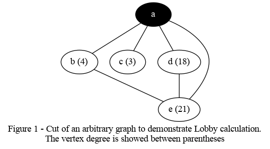

# Lobby Centrality

 Given a set of neighbors from a vertex _v_, the Lobby centrality or
h-index is calculated by ranking the neighbors of _v_ according to
their degrees in a decreasing order, and selecting the last position
where its degree is less or equal than its position value.

The Fig. 1 presents a cut of an arbitrary graph, containing only
the vertices of interest, to demonstrate the Lobby index calculation of
vertex _a_.



The list of _a_ neighbors is ordered by degree in the table. The Lobby
index of _a_ is **3** because it is the last position where the degree
of the neighbor is greater than its position in the ranking.


| neighbor | position | degree |
|:--------:|:--------:|:------:|
| "e"      | 1        | 21     |
| "d"      | 2        | 18     |
| "b"      | **3**    | **4**  |
| "c"      | 4        | 3      |


The Python3 code to process the table data should be:

```python
def lobby(v2degs):
    '''Return the Lobby index from a dictionary of vertices and degrees'''
    l = 0 # Lobby index
    # Sort the degree values
    degs = sorted(v2degs.values(), reverse=True)
    for deg in degs:
        l += 1
        if deg <= l: # Found Lobby index
            break
    return l

v2degs = {"b": 4, "c": 3, "d": 18, "e": 21 }
print("The lobby index is {}".format(lobby(v2degs)))

```

## References

1. Hirsch, J. E. ["An index to quantify an individual's scientific
   research
   output"](https://www.ncbi.nlm.nih.gov/pmc/articles/PMC1283832/). PNAS
   102 (46), 2005.

2.  A. Korn, A. Schubert, A. Telcs. [Lobby index in
    networks](https://www.sciencedirect.com/science/article/abs/pii/S0378437109001587)
    Physica A, 388 (11), 2009.

3. M. G. Campiteli, A. J. Holanda, L. D. H. Soares, P. R. C. Soles, O. Kinouchi.
  [Lobby index as a network centrality measure](Lobby index as a network centrality measure).
  Physica A, 394, 2014.

---
Feel free to send suggestions or corrections via [issue](https://github.com/ajholanda/lobby-centrality/issues).
